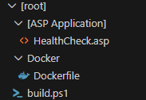

# Containerizing Classic ASP Applications

## Overview

This document outlines the approach for migrating a Classic ASP
application using ODBC drivers to connect to a database into an Azure
Application Service. Classic ASP applications are hosted on a server
that runs Internet Information Services with ASP enabled. There is no
Classic ASP option within Azure for hosting the application via native
Azure services; the application would require a complete rewrite to be
migrated into a cloud native service.

This method allows the application to run in a container on Azure App
Services without requiring code changes. The result is an updated
infrastructure that aligns with other planned modernization efforts.

## Files and Directories

The ASP application would be populated with all the files that are
currently developed for the ASP application, the complete applications
root directory of the ASP application. A HealthCheck.asp page would be
added to the files which would be used by the App Service to determine
if the application is healthy or not. At a minimum this ASP page would
be used to let the service know that the application is available,
however it could also be extended to report if the application's
database connection is healthy as well as any other checks needed to
ensure that the application is functional



## Container Image

The Container image for this application would be based on the Windows
Server Core 2019 Long Term Servicing Channel (LTSC) image. This provides
the container with an image capable of hosting Internet Information
Services. The image would be tailored to also enable Classic ASP. Two
pieces of software will be obtained and included in this image which
includes the Microsoft ODBC 18 drivers as well as its prerequisite, the
Visual C++ Redistributable package.
```
 FROM                                                                     
 mcr.microsoft.com/dotnet/framework/aspnet:4.8-windowsservercore-ltsc2019 
                                                                          
 SHELL \[\"powershell\", \"-command\"\]                                   
                                                                          
 RUN Install-WindowsFeature Web-ASP;                                      
                                                                          
 RUN Install-WindowsFeature Web-CGI;                                      
                                                                          
 RUN Install-WindowsFeature Web-ISAPI-Ext;                                
                                                                          
 RUN Install-WindowsFeature Web-ISAPI-Filter;                             
                                                                          
 RUN Install-WindowsFeature Web-Includes;                                 
                                                                          
 RUN Install-WindowsFeature Web-HTTP-Errors;                              
                                                                          
 RUN Install-WindowsFeature Web-Common-HTTP;                              
                                                                          
 RUN Install-WindowsFeature Web-Performance;                              
                                                                          
 RUN Install-WindowsFeature WAS;                                          
                                                                          
 RUN Import-module IISAdministration;                                     
                                                                          
 RUN md c:/msi;                                                           
                                                                          
 RUN Invoke-WebRequest \'https://aka.ms/vs/15/release/vc_redist.x64.exe\' 
 -OutFile c:/msi/vc_redist.x64.exe;                                       
                                                                          
 RUN Start-Process \"c:/msi/vc_redist.x64.exe\" -ArgumentList \"/quiet\", 
 \"/norestart\" -Wait -NoNewWindow                                        
                                                                          
 RUN Invoke-WebRequest                                                    
 \'https://go.microsoft.com/fwlink/?linkid=2345415\' -OutFile             
 c:/msi/msodbcsql18.msi;                                                  
                                                                          
 RUN Start-Process \"msiexec.exe\" -ArgumentList \"/i\",                  
 \"c:\\msi\\msodbcsql18.msi\", \"IACCEPTMSODBCSQLLICENSETERMS=YES\",      
 \"ADDLOCAL=ALL\", \"/qn\" -Wait -NoNewWindow                             
                                                                          
 EXPOSE 80                                                                
                                                                          
 RUN Remove-Item -Recurse C:\\inetpub\\wwwroot\\\*                        
                                                                          
 RUN & c:\\windows\\system32\\inetsrv\\appcmd.exe unlock config           
 /section:system.webServer/asp                                            
                                                                          
 RUN & c:\\windows\\system32\\inetsrv\\appcmd.exe unlock config           
 /section:system.webServer/handlers                                       
                                                                          
 RUN & c:\\windows\\system32\\inetsrv\\appcmd.exe unlock config           
 /section:system.webServer/modules                                        
                                                                          
 WORKDIR C:/inetpub/wwwroot/                                              
                                                                          
 COPY **\[ASP Application\]**/\* C:/inetpub/wwwroot/                      
```
### Build and Deploy container to Azure

The image will be built using Docker locally and then pushed up to
Azure. This process requires an Azure login, and the account must have
the acrpush permission into the Azure Container Registry.
```
  Az login \--use-device-code\
  az acr login \--name \[acrcontainer\]\
  docker build -f Docker\\Dockerfile . -t \[classicaspapp\]\
  docker tag \[classicaspapp\]
  \[acrcontainer\].azurecr.io/\[classicaspapp\]:v1\
  docker push \[acrcontainer\].azurecr.io/\[classicaspapp\]:v1  
```  

When deploying to Azure, the Azure App Service that will run the
container must have a managed system identity enabled and that identity
must have the acrpull permission over the Azure Container Registry.
Additionally, if the application will communicate with an Azure SQL
database, the identity must be given login permissions to the Azure SQL
database.

### Local Container

The image may be built and run locally for testing purposes.

#### Build and Run

These steps outline how to build and run the image locally. They must be
performed when the \[classicaspapp\] container is not present or running
to avoid port conflicts.
```
 docker build -f Docker\\Dockerfile . -t \[classicaspapp\]            
                                                                      
 docker run -d -p 8080:80 \--env                                      
 ConnectionString=\"\<connectionString\> \"  \--name                  
 \[classicaspapp\] \[classicaspapp\]                                  
```
####  Stop and Delete

These steps outline how to stop and delete the \[classicaspapp\]
container. This step will routinely be used if you are rerunning a
deploy locally.
```
  docker stop \[classicaspapp\]\
  docker rm \[classicaspapp\]
```  

## Azure Application Configuration

Application configuration values, including database connection strings,
should not be hardcoded in the application. These values should be
defined within the App Service and referenced in the application. This
may be done by instantiating a shell object and then use that to
reference the environment variables within the process.
```
 Set objWSH =  CreateObject(\"WScript.Shell\")                        
                                                                      
 connectionString =                                                   
  objWSH.Environment(\"PROCESS\")(\"ConnectionString\")               
```
#### Azure Key Vault

When referencing secrets (ie. passwords or sensitive data) a reference
from the App Service to the Azure Key Vault may be used. To configure
this, the identity of the app service must be able to read the secrets
in the Key Vault; it must be given the Key Vault Secrets User role
assignment on the Key Vault.

### Hosted with no System Identity

It is recommended that either a system identity be used for
authentication the application against the database, however if a sql
user and password is required then the connection string should follow
this pattern.
```
  Driver={ODBC Driver 18 for SQL
  Server};Server=\[azuresqlserver\].database.windows.net,1433;Database=\[databasename\];Uid=\[username\];Pwd=\[password\];Encrypt=yes;TrustServerCertificate=no;Connection
  Timeout=30;
```  

### Hosted with System Identity

A connection string with a system identity will follow this pattern.
```
  Driver={ODBC Driver 18 for SQL
  Server};Server=\[azuresqlserver\].database.windows.net,1433;Database=\[
  databasename\];Authentication=ActiveDirectoryMSI;Encrypt=yes;TrustServerCertificate=no;Connection
  Timeout=30;
```

#### Azure SQL

When using a managed system identity, the identity must be granted
permission to log into the database and to perform database roles. This
may be done by logging into the Azure SQL database with an Entra account
and then running a few commands to enable the account to connect and
then be given the right permissions. An example of this is included
below.
```
  CREATE USER \[ClassicASPIdentity\] FROM EXTERNAL PROVIDER;\
  ALTER ROLE db_datareader ADD MEMBER \[ClassicASPIdentity\]\
  ALTER ROLE db_datawriter ADD MEMBER \[ClassicASPIdentity\]
```

### Health and Monitoring

The Health of the Classic ASP application within a container may be
monitored by including a Healthcheck.asp page. The Healthcheck page will
provide basic availability information and may be extended to indicate
whether the connection string to the database is valid and if the
application can open the connection. A separate Healthcheck page is
recommended and this page should always be included in all containers
hosting Classic ASP. The healthcheck.asp page does not include
application code; the page is purely used for diagnostic purposes.

The site may be monitored through the logging mechanisms within the App
Service. If additional logging is required, the inclusion of a blob
container may be required whereas the logs may be written to a blob file
and then consumed by Azure Monitor.
